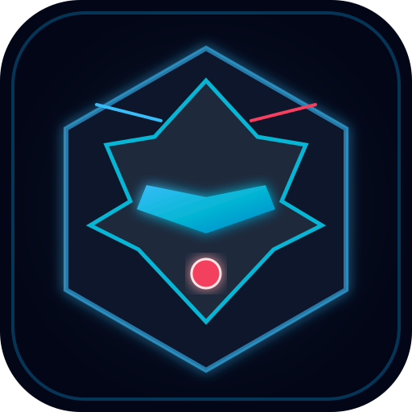

# ⚔️ MECHA CLASH

<p align="center">
  
</p>

<p align="center">
  <strong>A high-octane, cybernetic 2D top-down mecha arena combat game built with React 19, TypeScript, HTML5 Canvas 2D, WebSockets, and Tailwind CSS v4.</strong>
</p>

<p align="center">
  
  
  
  
  
  
</p>

---

## 📖 Table of Contents

- [Overview](#-overview)
- [Key Features](#-key-features)
- [Game Modes](#-game-modes)
- [Combat System & Controls](#-combat-system--controls)
- [Tech Stack](#-tech-stack)
- [Project Structure](#-project-structure)
- [Network Architecture & Dual-WebSocket System](#-network-architecture--dual-websocket-system)
- [Installation & Setup](#-installation--setup)
- [Available Scripts](#-available-scripts)
- [Troubleshooting & FAQs](#-troubleshooting--faqs)
- [Environment Variables](#-environment-variables)
- [Deployment](#-deployment)
- [Author & License](#-author--license)

---

## ⚡ Overview

Pilot the high-agility combat chassis **VEX** against **NOVA**, an adaptive neural-network combat AI, or challenge other players across the globe in **Real-Time Cross-Device Online Multiplayer**.

Master directional maneuvering, precision energy-blade strikes, burst thruster dashes equipped with invulnerability frames (`i-frames`), omnidirectional **360° Energy Burst Ultimates**, and arena pickups while dodging dynamic environmental hazards and surviving multi-phase **Boss Encounters**.

```text
+-------------------------------------------------------------------------------+
| [PLAYER 1: VEX]                    ROUND 1                   [PLAYER 2: NOVA] |
| HP: [|||||||||||||||||||] 100/100  SCORE: 4,850   HP: [|||||||||||||.....] 65 |
| LIVES: ● ● ●                                                      LIVES: ● ● ○ |
|                                                                               |
|                       ⚡ [POWER-UP: DOUBLE DAMAGE]                            |
|                                                                               |
|            ( VEX )                                    ( NOVA )                |
|               \====> [ENERGY BLADE SLASH]                 /                   |
|                                                                               |
|                                               (=== PULSING LASER GRID ===)    |
|                                                                               |
|  [VIRTUAL JOYSTICK]                                      [BURST] [DASH] [ATK] |
+-------------------------------------------------------------------------------+
```

---

## 🚀 Key Features

### 🌐 Real-Time Online Multiplayer (1v1 Cross-Device)
- **Instant Room Codes**: Host generates a compact, human-readable 5-character alphanumeric code (e.g., `7K4P2`).
- **Cross-Platform Play**: Seamless gameplay across desktops, laptops, tablets, and smartphones over Wi-Fi or mobile cellular networks.
- **Sub-50ms Low-Latency Synchronization**:
  - 20Hz throttled movement state synchronization with linear interpolation (`lerp`) for stutter-free position rendering.
  - Synchronized blade slashes, thruster dashes, and 360° Energy Burst activations.
  - Server-arbitrated damage calculations, knockback impulses, and shield deflections.
- **Synchronized Power-Up Spawns**: Real-time pickup drops visible and contestable by both combatants simultaneously.
- **Best-of-3 Competitive Match Flow**: Full round-transition overlays, victory/defeat recaps, rematch voting, and opponent disconnect detection with auto-recovery.

### ⚔️ Fluid Cybernetic Combat Mechanics
- **Energy-Blade Slash**: Close-quarters arc sweep dealing high-impact damage with directional hit stun.
- **Burst Dash with I-Frames**: Instant velocity boost providing invulnerability frames (`i-frames`) to weave through incoming strikes and laser beams.
- **360° Energy Burst (Ultimate)**: Radial kinetic shockwave clearing hazards, dealing high radial damage, and granting temporary invulnerability during activation.
- **Armor & Hull Integrity**: 100 HP hull integrity, 3 lives per duel, shield absorption mechanics, and hit-recovery windows.

### 🤖 Adaptive AI Personalities (NOVA)
- **Balanced Sentinel**: Calculated positioning, adaptive counters, and steady zoning.
- **Brawler**: Relentless close-quarters aggression, cornering maneuvers, and rapid punish combos.
- **Flanker**: High-speed circling, diagonal thruster cuts, and bait tactics.
- **Kiter**: Distance control, opportunistic hit-and-run strikes, and power-up denial.
- **Apex Overlord**: High-tier AI combining predictive movement, frame-perfect dodges, and aggressive power-up starvation.

### ⚡ Battlefield Hazards & Tactical Pickups
- **Environmental Hazards**:
  - **Collapsing Arena Panels**: Floor plates flash flashing warning borders before dropping into the void.
  - **Sweeping Laser Barriers**: Horizontal and vertical laser beams moving systematically across the combat zone.
  - **Electrical Hazard Nodes**: Pulsing static traps that zap combatants within their radius.
- **Combat Pickups**:
  - `SHIELD`: Grants complete damage immunity against the next hit.
  - `POWER_ATTACK`: Doubles attack damage on the next blade slash (2× damage).
  - `SPEED_BOOST`: Increases thruster velocity to 300 px/sec.
  - `HEAL`: Restores 25 points of critical hull integrity.
  - `ENERGY`: Instantly refreshes Dash and Ultimate cooldown gauges.

### 📱 Ergonomic Mobile & Desktop Experience
- **Desktop Controls**: Full keyboard (WASD / Arrows / Space / F / G) and mouse buttons.
- **Mobile Virtual Touchpad**: High-precision floating analog joystick on the left screen half, tactile action buttons (`ATTACK`, `DASH`, `BURST`) on the right.
- **Live Battery Monitor**: Real-time device battery indicator and charging status updating every 30 seconds.
- **Fullscreen Mode**: One-touch fullscreen toggle with landscape lock optimization.

---

## 🎮 Game Modes

1. **Quick Duel**: Instant 1v1 exhibition skirmish against NOVA across 5 selectable difficulty tiers:
   - `NORMAL` — Balanced for newcomers.
   - `MEDIUM` — Faster AI reactions and offensive dashes.
   - `HARD` — Relentless pursuit and tactical power-up collection.
   - `EXTREME_HARD` — Predictive dodging and high combat pressure.
   - `HARDCORE` — Frame-perfect AI aggression and minimal reaction windows.
2. **50-Level Campaign**: 5 thematic chapters featuring unique color matrices, mission briefings, and multi-phase boss fights:
   - **Chapter 1: Awakening** (Levels 1–10 • Cyan Matrix Theme)
   - **Chapter 2: Rising Threat** (Levels 11–20 • Neon Purple Theme)
   - **Chapter 3: War Machine** (Levels 21–30 • Crimson Forge Theme)
   - **Chapter 4: Cyber Siege** (Levels 31–40 • Emerald Nexus Theme)
   - **Chapter 5: Apex Overlord** (Levels 41–50 • Gold Core Final Confrontation)
3. **Endless Survival**: Battle an endless stream of increasingly deadly mecha adversaries with persistent score tracking and global high scores.
4. **Online Multiplayer**: Real-time cross-device lobby battles with custom room codes and best-of-3 competition.

---

## 🕹️ Combat System & Controls

### Controls Reference

| Action | Desktop Keyboard | Mouse / Touch Controls |
|:---|:---|:---|
| **Move Up / Down / Left / Right** | `W`, `A`, `S`, `D` / Arrow Keys | Virtual Analog Joystick (Mobile Left Screen) |
| **Energy Slash (Attack)** | `F` | Left Mouse Click / `ATTACK` Button |
| **Burst Dash (i-frames)** | `G` | Right Mouse Click / `DASH` Button |
| **360° Energy Burst (Ultimate)** | `Space` | `BURST` Button |
| **Pause Game** | `P` or `Escape` | `PAUSE` Button (Top HUD) |
| **Mute / Unmute Audio** | `M` | Audio Icon (Top HUD) |
| **Fullscreen Toggle** | `F11` | Fullscreen Icon (Top-Right HUD) |

### Tactical Combat Tips
- **Exploit I-Frames**: When an opponent begins an energy slash or a laser barrier sweeps toward you, dash directly into the hazard. The invulnerability frames will pass you through without receiving damage.
- **Deny Pickups**: Prioritize contested items in the arena center. Denying an opponent a `SHIELD` or `2× DAMAGE` pickup is crucial for match control.
- **Burst Defense**: Use your 360° Energy Burst defensively when cornered against an arena boundary or when an enemy executes a dash-slash combo.

---

## 🛠️ Tech Stack

| Technology | Purpose |
|:---|:---|
| **[React 19](https://react.dev/)** | State-driven user interface, dynamic modals, and HUD overlays |
| **[TypeScript](https://www.typescriptlang.org/)** | Type safety across game entities, physics, and network payloads |
| **[Vite 8](https://vitejs.dev/)** | Next-generation build tooling and lightning-fast HMR dev server |
| **[Tailwind CSS v4](https://tailwindcss.com/)** | Ultra-performant utility-first styling with `@tailwindcss/vite` |
| **[WebSockets (ws)](https://github.com/websockets/ws)** | Low-latency binary/JSON real-time multiplayer server and room arbiter |
| **[Express 4](https://expressjs.com/)** | Full-stack server hosting REST room endpoints and Vite middleware |
| **HTML5 Canvas 2D API** | Custom 60 FPS graphics engine with particle emitters and screen shake |
| **Web Audio API** | 100% procedural sound effect synthesizer (zero external audio assets) |
| **[Lucide React](https://lucide.dev/)** | Minimalist vector icons for UI and HUD controls |
| **[Motion](https://motion.dev/)** | Smooth animated modal entries and screen transitions |

---

## 📁 Project Structure

```text
mecha-clash/
├── server.ts                   # Express full-stack server + WebSocket multiplayer room manager
├── vite.config.ts              # Vite 8 configuration with React and Tailwind v4 plugins
├── index.html                  # HTML5 entry with mobile safe-area viewport tags
├── package.json                # Project dependencies, scripts, and package metadata
├── tsconfig.json               # TypeScript strict configuration
├── .env.example                # Template for environment variables
├── public/
│   ├── icon.svg                # Vector mecha emblem
│   └── manifest.json           # Web app manifest for PWA installation
└── src/
    ├── main.tsx                # Application mounting point
    ├── App.tsx                 # Screen router (Menu, Campaign, Multiplayer, Battle)
    ├── index.css               # Design system, cybernetic fonts, and Tailwind directives
    ├── audio/
    │   └── soundManager.ts     # Procedural Web Audio API sound generator
    ├── components/
    │   ├── CampaignSelect.tsx  # 50-level campaign mission roadmap
    │   ├── CountdownOverlay.tsx# Pre-round countdown banner (3... 2... 1... FIGHT!)
    │   ├── DefeatModal.tsx     # Defeat recap with retry and menu navigation
    │   ├── DifficultySelect.tsx# Quick Duel difficulty picker
    │   ├── GameCanvas.tsx      # Main game canvas mount and loop driver
    │   ├── HowToPlay.tsx       # Combat primers and control instructions
    │   ├── HUD.tsx             # Real-time health gauges, battery stats, controls
    │   ├── MainMenu.tsx        # Title screen with mode selectors
    │   ├── MultiplayerLobby.tsx# Room creation, joining, and code sharing
    │   ├── MultiplayerModal.tsx# Post-match multiplayer victory/defeat & rematch
    │   ├── PauseModal.tsx      # In-game pause menu
    │   ├── RoundEndOverlay.tsx # Round transition banner
    │   ├── VictoryModal.tsx    # Campaign & Endless victory recaps
    │   └── VirtualControls.tsx # Mobile on-screen analog joystick and buttons
    ├── game/
    │   ├── constants.ts        # Arena dimensions, weapon metrics, and damage values
    │   ├── engine.ts           # Game physics, collision detection, and network lerp
    │   ├── ai.ts               # Adaptive AI decision tree and personality profiles
    │   └── renderer.ts         # High-performance Canvas 2D renderer and particles
    ├── network/
    │   └── multiplayerClient.ts# Resilient WebSocket client with automatic reconnection
    ├── types/
    │   ├── game.ts             # Game entities, hazards, power-ups, and level definitions
    │   └── multiplayer.ts      # Client/server network protocol message interfaces
    └── utils/
        └── fullscreen.ts       # Fullscreen API wrapper with mobile orientation lock
```

---

## 🔌 Network Architecture & Dual-WebSocket System

MECHA CLASH implements a clean separation between development tooling and game runtime sockets:

```text
                                  Browser Client
                                        │
                    ┌───────────────────┴───────────────────┐
                    ▼                                       ▼
             Vite HMR Client                    MECHA CLASH Game Client
         (Path: /?token=...)                       (Path: /ws?room=...)
     sec-websocket-protocol: vite-hmr                        │
                    │                                       │
                    └───────────────────┬───────────────────┘
                                        ▼
                               Node.js HTTP Server
                            (server.on('upgrade', ...))
                                        │
                    ┌───────────────────┴───────────────────┐
                    ▼                                       ▼
        Path === '/' & vite-hmr?                 Path === '/ws'?
                    │                                       │
                    ▼                                       ▼
            Vite Dev Server                   ws.WebSocketServer
         (Code Hot-Reloading)               (Room State, 20Hz Sync)
```

### REST API Endpoints
- `POST /api/multiplayer/room/create` — Generates a unique 5-char room code and registers Player 1.
- `POST /api/multiplayer/room/join` — Validates code, checks capacity, and registers Player 2.
- `POST /api/multiplayer/room/leave` — Handles player departure and cleans up abandoned rooms.
- `GET  /api/multiplayer/room/:code` — Returns current room state and connected players.
- `GET  /health` & `GET /api/health` — Service health check endpoint.

---

## 💻 Installation & Setup

### 1. Prerequisites
- **Node.js**: `v18.0.0` or higher (recommended: Node `v20.x` or `v22.x`)
- **npm**: `v9.0.0` or higher

### 2. Clone the Repository
```bash
git clone https://github.com/Sarthak-850/mecha-clash.git
cd mecha-clash
```

### 3. Install Dependencies
```bash
npm install
```

---

## 🚀 Available Scripts

In the project directory, you can run:

### `npm run dev`
Starts the full-stack development server at `http://localhost:3000`.  
Includes both the **Express API + WebSocket Server** and **Vite Hot Module Replacement (HMR)** middleware.

### `npm run dev:web`
Starts the standalone Vite development server without the Express backend (ideal for UI/canvas iteration).

### `npm run build`
Compiles TypeScript and bundles production-ready static assets into the `dist/` directory via Vite.

### `npm run start`
Launches the full-stack production server (`tsx server.ts` with `NODE_ENV=production`) serving the pre-compiled `dist/` bundle on port 3000.

### `npm run preview`
Locally previews the production build output from `dist/` using Vite preview.

### `npm run lint`
Runs the TypeScript compiler (`tsc --noEmit`) to validate type safety across all files without emitting code.

### `npm run clean`
Removes the `dist/` folder and compiled artifacts.

---

## ❓ Troubleshooting & FAQs

### Error: `listen EADDRINUSE: address already in use 0.0.0.0:3000`
**Cause**: Another process (e.g., an earlier running server instance) is already using port `3000`.

**Solutions**:
- **Option 1: Kill the process on port 3000**:
  - *Windows (PowerShell)*:
    ```powershell
    # Find process on port 3000
    netstat -ano | findstr :3000
    # Terminate process by PID (e.g. 53848)
    taskkill /F /PID 53848
    ```
  - *macOS / Linux*:
    ```bash
    kill -9 $(lsof -t -i:3000)
    ```
- **Option 2: Run on a different port**:
  - *Windows (PowerShell)*:
    ```powershell
    $env:PORT=3001; npm run dev
    ```
  - *macOS / Linux*:
    ```bash
    PORT=3001 npm run dev
    ```

### Error: `[vite] failed to connect to websocket`
**Cause**: A development WebSocket was intercepted or blocked.  
**Resolution**: Ensure you are running the latest `server.ts` code, which permits `vite-hmr` WebSocket upgrade requests to pass through cleanly to Vite during development. Note that production builds in `dist/` contain zero HMR code.

---

## 🔑 Environment Variables

Create a `.env` file in the root directory if you need to override default settings:

```env
# Server Port (Default: 3000)
PORT=3000

# Environment Mode ('development' or 'production')
NODE_ENV=development

# Optional: Dedicated external WebSocket backend URL (e.g., Cloud Run or Railway)
# If left empty, automatically uses the current browser origin (ws:// or wss://)
VITE_MULTIPLAYER_URL=""

# Optional: Google Gemini API Key for extended AI capabilities
GEMINI_API_KEY=""

# Optional: Public Application URL
APP_URL="http://localhost:3000"
```

---

## 🌐 Deployment

### 1. Static Web Hosting (Vercel, Netlify, GitHub Pages)
To host the frontend game client (single player, campaign, and endless modes):
```bash
npm run build
```
- **Build Command**: `npm run build`
- **Output Directory**: `dist`
- **Install Command**: `npm install`

### 2. Full-Stack / Multiplayer Hosting (Cloud Run, Render, Railway, Fly.io)
To host both the web client and the real-time WebSocket room server:
- **Build Command**: `npm run build`
- **Start Command**: `npm run start` (or `node --import tsx server.ts`)
- **Port**: Bind to `0.0.0.0` using `$PORT` (handled automatically by `server.ts`).

---

## 👨‍💻 Author & License

- **Author**: **Sarthak Raikwar**
- **GitHub**: [@Sarthak-850](https://github.com/Sarthak-850)
- **License**: Released under the [MIT License](https://opensource.org/licenses/MIT).
